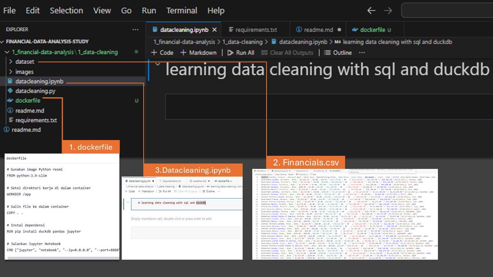
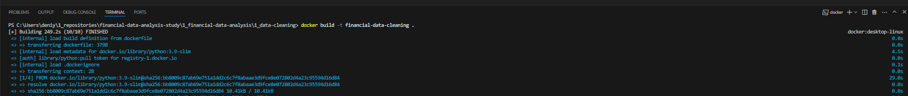
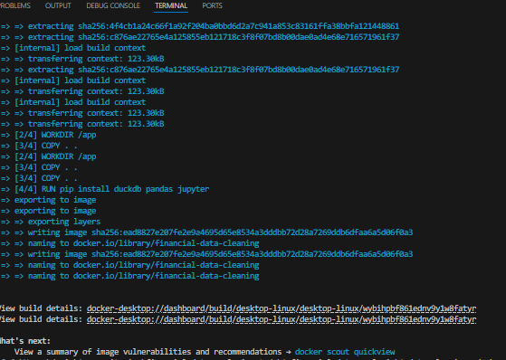
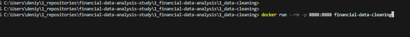
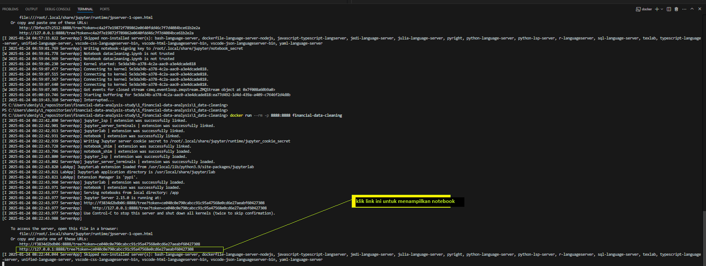
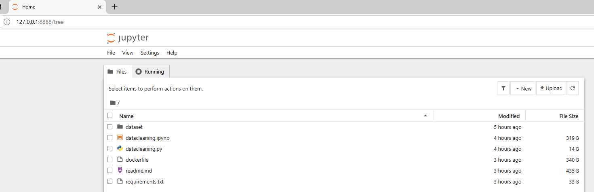

# Data Cleaning and Formatting with Duckdb, sql, python

## Overview
This project demonstrates how to clean and format financial data using DuckDB and SQLite within a Docker environment.

## Setup This Repository

### Prerequisites
- Docker: [Install Docker](https://www.docker.com/)
- Docker Compose: Included with Docker Desktop

### Steps
1. Clone the repository:
   ```sh
   git clone <repository_url>
   cd <repository_directory>

## Creating this project
### 1. create project 
- open visual studio code, create your folder project and name it (on this project '1_data-cleaning)
### 2. create this files :

1. dockerfile
      * buat `Dockerfile` untuk menginstal Jupyter dan menjalankan notebook. Berikut kodenya:

      ```dockerfile
      # Gunakan image Python resmi
      FROM python:3.9-slim

      # Setel direktori kerja di dalam container
      WORKDIR /app

      # Salin file ke dalam container
      COPY . .

      # Instal dependensi
      RUN pip install duckdb pandas jupyter

      # Jalankan Jupyter Notebook
      CMD ["jupyter", "notebook", "--ip=0.0.0.0", "--port=8888", "--no-browser", "--allow-root"]
      ```
2. download `Financials.csv`and put on dataset folder
3. datacleaning.ipynb
   * buat notebook baru
   * isi teks markdown *optional*
4. requirement.txt, readme.md optional optional

5. minimal struktur direktorinya seperti berikut:

   ```
   /1_data-cleaning
   ├── Dockerfile
   ├── dataset 
   |    ├── financial.csv
   └── notebook.ipynb
   ```
### 3. Build and Run Docker 
1. **Build Docker Image**
   * buka terminal di visual studio code 
   * Jalankan perintah berikut untuk membangun image Docker:

      ```bash
      docker build -t financial-data-cleaning .
      ```
   * berikut previewnya :

      
   * tunggu hingga proses docker-buildnya selesai :

      

2. **Jalankan Docker Container dan Jupiter Notebook**

   * Jalankan container dan map port untuk mengakses Jupyter Notebook dari browser Anda:

      ```bash
      docker run --rm -p 8888:8888 financial-data-cleaning
      ```
      

   * Setelah container berjalan, Anda akan mendapatkan URL dengan token untuk mengakses Jupyter Notebook di browser Anda.

      

   * tampilan jupiter notebook

      

## running duck db on jupyter notebook
